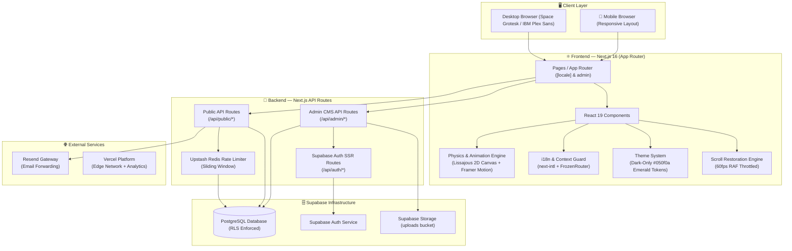
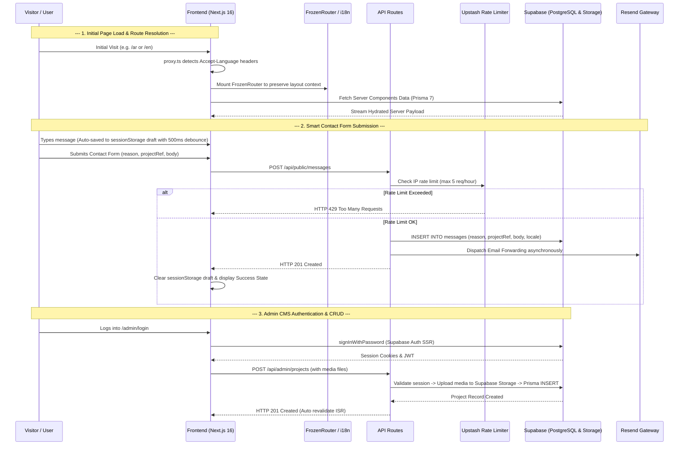
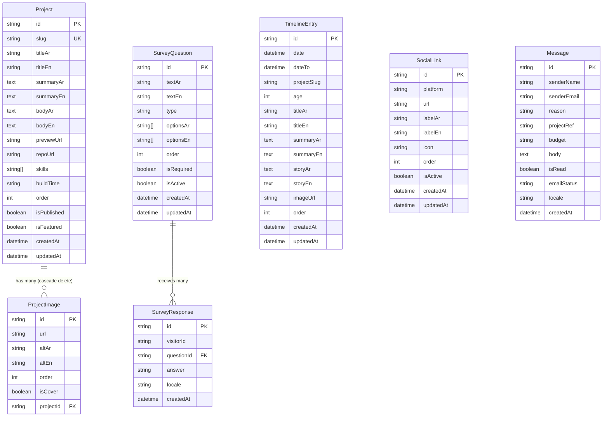

# 🏗️ System Architecture & Data Model
## Abdullah.div — v2.0 "Signal & Growth"

---

## 1. High-Level Architecture



---

## 2. Data Flow Pattern



---

## 3. Project Structure

```
abdullah-div/
├── docs/                               # 📚 Technical system documentation
│   ├── 01-PRD.md                       # Product Requirements Document (v2.0)
│   ├── 02-SYSTEM-ARCHITECTURE.md       # Architecture & Data Model (v2.0)
│   ├── 03-UI-UX-SPECIFICATIONS.md      # Design System, Motion Specs & Math Models (v2.0)
│   └── 04-CHANGELOG.md                 # Architecture Decision Records & Change History
├── prisma/
│   ├── schema.prisma                   # Active Prisma 7 schema (PostgreSQL)
│   └── migrations/                     # PostgreSQL SQL migrations
├── public/
│   └── favicon.ico                     # Branding favicon
├── src/
│   ├── app/
│   │   ├── [locale]/                   # 🌐 Dynamic i18n routing (next-intl)
│   │   │   ├── page.tsx                # Home (Lissajous Hero + Uniform Projects Grid)
│   │   │   ├── portfolio/              # Full Portfolio listing + Project details
│   │   │   ├── journey/                # Single-Rail Journey Timeline
│   │   │   ├── contact/                # Multi-Intent Smart Contact Form
│   │   │   └── layout.tsx              # Root Locale Layout with FrozenRouter & Analytics
│   │   ├── admin/                      # 🔐 Protected Admin CMS Dashboard
│   │   │   ├── projects/               # Project CRUD & Image Management
│   │   │   ├── timeline/               # Milestone Management
│   │   │   ├── social-links/           # Social Links Management
│   │   │   ├── messages/               # Contact Submissions Inbox
│   │   │   ├── login/                  # Admin Auth Login
│   │   │   └── layout.tsx              # Admin Shell & Auth Guard
│   │   ├── api/
│   │   │   ├── admin/                  # Protected Admin Endpoints
│   │   │   ├── auth/                   # Authentication API Endpoints
│   │   │   └── public/                 # Public Endpoints (/api/public/*)
│   │   ├── globals.css                 # Dark-only design tokens & global styles
│   │   └── fonts.ts                    # Google Fonts (Space Grotesk, IBM Plex Sans, JetBrains)
│   ├── components/
│   │   ├── hero/                       # LissajousCurve, FloatingText, HeroSection
│   │   ├── portfolio/                  # PortfolioList, ProjectDetail, ProjectLightbox
│   │   ├── journey/                    # Timeline, timelineMath
│   │   ├── contact/                    # ContactForm
│   │   ├── admin/                      # ImageUpload, ProjectImagesManager, SkillsManager
│   │   └── shared/                     # LavaBackground, PulseBorder, MarkdownRenderer,
│   │                                   # PageTransition, ScrollRestoration, Navbar, Footer
│   ├── generated/
│   │   └── prisma/                     # Custom Prisma Client output directory
│   ├── i18n/                           # Routing configuration & navigation helpers
│   ├── lib/
│   │   ├── auth/                       # require-admin middleware & session validation
│   │   ├── prisma.ts                   # Prisma client singleton instance
│   │   ├── rate-limit.ts               # Upstash Redis rate limiter
│   │   ├── format-build-time.ts        # Structured duration parser & pluralization engine
│   │   ├── supabase/                   # Server, Client & Admin Supabase wrappers
│   │   └── resend/                     # Resend client & email templates
│   ├── messages/                       # Localized dictionaries (ar.json, en.json)
│   ├── proxy.ts                        # Edge locale negotiation helper
│   ├── tests/                          # Vitest test setup and mocks
│   └── types/                          # Shared TypeScript interfaces & API schemas
├── package.json                        # Scripts & dependencies
├── vitest.config.ts                    # Vitest configuration
├── tsconfig.json                       # TypeScript compiler options
└── next.config.ts                      # Next.js configuration
```

---

## 4. Confirmed Tech Stack

### Frontend & Rendering Layer

| Component | Technology | Version | Purpose / Rationale |
|---|---|---|---|
| **Framework** | **Next.js (App Router)** | 16.1.6 | Hybrid Server/Client components, dynamic routing, Edge proxy |
| **Core UI Engine** | **React** | 19.2.3 | Modern concurrent rendering, Server Actions compatibility |
| **Language** | **TypeScript** | 5.x | Strict end-to-end type safety |
| **Styling** | **Tailwind CSS** | 4.x | PostCSS-driven dark-only styling, CSS custom property tokens |
| **Latin Display Font** | **Space Grotesk** | Google Fonts | Technical, geometric character for display headings |
| **Arabic Text Font** | **IBM Plex Sans Arabic** | Google Fonts | Crisp Arabic typography across all weights |
| **Technical Mono Font** | **JetBrains Mono** | Google Fonts | High-precision code blocks, numerical timestamps, and tags |
| **Motion & Transitions** | **Framer Motion** | 12.34.0 | Shared-element `layoutId` expansion, distance-stagger ripple |
| **Physics Simulation** | **HTML5 Canvas 2D** | Native | 60fps Lissajous parametric curves & Kepler orbit dynamics |

### Backend, Data & Security Layer

| Component | Technology | Version | Purpose / Rationale |
|---|---|---|---|
| **Database** | **Supabase (PostgreSQL)** | Cloud | Managed relational database with pgBouncer pooling |
| **ORM** | **Prisma** | 7.3.0 | `@prisma/adapter-pg`, custom output `@/generated/prisma` |
| **Identity & Auth** | **Supabase Auth SSR** | 0.8.0 | Cookie-based session verification; public signup disabled |
| **Media Storage** | **Supabase Storage** | Cloud | Project assets hosting in public `uploads` bucket |
| **Rate Limiter** | **Upstash Redis** | 2.0.8 | Serverless sliding-window rate limiting on transactional routes |
| **Email Gateway** | **Resend** | 6.9.2 | Asynchronous email dispatch with transactional fail-safes |
| **Internationalization** | **next-intl** | 4.8.2 | Dynamic dual-locale routing (`/ar` & `/en`) with dictionary keys |
| **Markdown Pipeline** | **react-markdown** | 10.1.0 | Rich-text parsing with `remark-gfm` and `remark-breaks` |
| **Testing Suite** | **Vitest** | 4.0.18 | 78 automated unit tests with `@testing-library/react` and `jsdom` |

---

## 5. Data Model & Prisma 7 Schema

### 5.1 Active Prisma Schema

```prisma
// ==============================================
// Abdullah.div — Prisma Schema v2.0
// Database: Supabase (PostgreSQL)
// Auth: Supabase Auth (Managed externally)
// ==============================================

generator client {
  provider = "prisma-client"
  output   = "../src/generated/prisma"
}

datasource db {
  provider = "postgresql"
}

// ─────────────────────────────────────────────
// Social Links — Navigation Shortcuts
// ─────────────────────────────────────────────
model SocialLink {
  id       String  @id @default(cuid())
  platform String  // whatsapp, linkedin, mostaql, github, etc.
  url      String
  labelAr  String  @map("label_ar")
  labelEn  String  @map("label_en")
  icon     String?
  order    Int     @default(0)
  isActive Boolean @default(true) @map("is_active")

  createdAt DateTime @default(now()) @map("created_at")
  updatedAt DateTime @updatedAt @map("updated_at")

  @@map("social_links")
}

// ─────────────────────────────────────────────
// Projects — Portfolio CMS
// ─────────────────────────────────────────────
model Project {
  id         String   @id @default(cuid())
  slug       String   @unique
  titleAr    String   @map("title_ar")
  titleEn    String   @map("title_en")
  summaryAr  String   @map("summary_ar") @db.Text
  summaryEn  String   @map("summary_en") @db.Text
  bodyAr     String   @map("body_ar") @db.Text
  bodyEn     String   @map("body_en") @db.Text
  previewUrl String?  @map("preview_url")
  repoUrl    String?  @map("repo_url")
  skills     String[]
  buildTime  String?  @map("build_time") // Format: "{amount}:{unit}"
  order      Int      @default(0)

  isPublished Boolean @default(false) @map("is_published")
  isFeatured  Boolean @default(false) @map("is_featured")

  images ProjectImage[]

  createdAt DateTime @default(now()) @map("created_at")
  updatedAt DateTime @updatedAt @map("updated_at")

  @@map("projects")
}

model ProjectImage {
  id      String  @id @default(cuid())
  url     String
  altAr   String? @map("alt_ar")
  altEn   String? @map("alt_en")
  order   Int     @default(0)
  isCover Boolean @default(false) @map("is_cover")

  projectId String  @map("project_id")
  project   Project @relation(fields: [projectId], references: [id], onDelete: Cascade)

  @@map("project_images")
}

// ─────────────────────────────────────────────
// Timeline Entries — Scientific Journey Log
// ─────────────────────────────────────────────
model TimelineEntry {
  id          String    @id @default(cuid())
  date        DateTime
  dateTo      DateTime? @map("date_to")      // Optional uncertainty range end
  projectSlug String?   @map("project_slug") // Linked project for in-place modal
  age         Int
  titleAr     String    @map("title_ar")
  titleEn     String    @map("title_en")
  summaryAr   String?   @map("summary_ar") @db.Text
  summaryEn   String?   @map("summary_en") @db.Text
  storyAr     String?   @map("story_ar") @db.Text
  storyEn     String?   @map("story_en") @db.Text
  imageUrl    String?   @map("image_url")
  order       Int       @default(0)

  createdAt DateTime @default(now()) @map("created_at")
  updatedAt DateTime @updatedAt @map("updated_at")

  @@map("timeline_entries")
}

// ─────────────────────────────────────────────
// Survey Questions
// ─────────────────────────────────────────────
model SurveyQuestion {
  id        String   @id @default(cuid())
  textAr    String   @map("text_ar")
  textEn    String   @map("text_en")
  type      String   // multiple_choice | free_text
  optionsAr String[] @map("options_ar")
  optionsEn String[] @map("options_en")
  order     Int      @default(0)

  isRequired Boolean @default(false) @map("is_required")
  isActive   Boolean @default(true) @map("is_active")

  responses SurveyResponse[]

  createdAt DateTime @default(now()) @map("created_at")
  updatedAt DateTime @updatedAt @map("updated_at")

  @@map("survey_questions")
}

// ─────────────────────────────────────────────
// Survey Responses
// ─────────────────────────────────────────────
model SurveyResponse {
  id        String @id @default(cuid())
  visitorId String @map("visitor_id")

  questionId String         @map("question_id")
  question   SurveyQuestion @relation(fields: [questionId], references: [id])

  answer String
  locale String @default("ar")

  createdAt DateTime @default(now()) @map("created_at")

  @@map("survey_responses")
}

// ─────────────────────────────────────────────
// Messages — Multi-Intent Contact Form (v2.0)
// ─────────────────────────────────────────────
model Message {
  id          String   @id @default(cuid())
  senderName  String   @map("sender_name")
  senderEmail String   @map("sender_email")
  reason      String   @map("reason")       // general | bug-report | academic | collaboration
  projectRef  String?  @map("project_ref")  // Associated project title or slug
  budget      String?  @map("budget")       // Optional legacy compatibility
  body        String   @db.Text

  isRead      Boolean  @default(false) @map("is_read")
  emailStatus String   @default("pending") @map("email_status") // pending | sent | failed
  locale      String   @default("ar")

  createdAt DateTime @default(now()) @map("created_at")

  @@map("messages")
}
```

### 5.2 Mermaid Entity-Relationship Diagram



---

## 6. API Specifications

### 6.1 Authentication & Row Level Security (RLS)

- **Authentication Engine:** Supabase Auth SSR via `@supabase/ssr`.
- **Registration Policy:** Public sign-up is **strictly disabled** in Supabase Auth settings to safeguard CMS routes.
- **Row-Level Security (RLS) Matrix:**

| Relation / Table | SELECT (Read) | INSERT (Write) | UPDATE / DELETE |
|---|---|---|---|
| `Project` | ✅ Public (where `isPublished = true`) | 🔒 Authenticated Only | 🔒 Authenticated Only |
| `ProjectImage` | ✅ Public | 🔒 Authenticated Only | 🔒 Authenticated Only |
| `TimelineEntry` | ✅ Public | 🔒 Authenticated Only | 🔒 Authenticated Only |
| `SocialLink` | ✅ Public (where `isActive = true`) | 🔒 Authenticated Only | 🔒 Authenticated Only |
| `SurveyQuestion` | ✅ Public (where `isActive = true`) | 🔒 Authenticated Only | 🔒 Authenticated Only |
| `SurveyResponse` | 🔒 Authenticated Only | ✅ Public (Rate Limited) | ❌ Restricted |
| `Message` | 🔒 Authenticated Only | ✅ Public (Rate Limited) | 🔒 Authenticated Only |

---

### 6.2 Public API Endpoints

| Method | Endpoint | Description | Rate Limit |
|---|---|---|---|
| `GET` | `/api/public/projects` | List all published projects | None |
| `GET` | `/api/public/projects/:slug` | Retrieve full project details by unique slug | None |
| `GET` | `/api/public/projects-list` | Catalog of published project titles for issue picker | None |
| `GET` | `/api/public/timeline` | List chronological journey milestone checkpoints | None |
| `GET` | `/api/public/social-links` | List active social navigation shortcuts | None |
| `POST` | `/api/public/messages` | Submit smart contact form payload | 5 req / IP / hr |

#### `POST /api/public/messages` Payload Schema:
```json
{
  "senderName": "Dr. Alan Turing",
  "senderEmail": "alan@turing.ac.uk",
  "reason": "academic",
  "projectRef": "quantum-double-slit-sim",
  "body": "Inquiry regarding the interference simulation methodology...",
  "locale": "en"
}
```

---

### 6.3 Admin Protected Endpoints

> All admin routes validate Supabase Auth session tokens via Next.js middleware and `requireAdmin` helper.

| Method | Endpoint | Description |
|---|---|---|
| `GET` / `POST` | `/api/admin/projects` | List all projects (including drafts) / Create project |
| `PUT` / `DELETE` | `/api/admin/projects/:id` | Update project parameters / Delete project & purge media from Supabase Storage |
| `GET` / `POST` | `/api/admin/timeline` | List milestone checkpoints / Create timeline milestone |
| `PUT` / `DELETE` | `/api/admin/timeline/:id` | Update milestone parameters / Delete milestone |
| `GET` / `POST` | `/api/admin/social-links` | List all social links / Create new social link |
| `PUT` / `DELETE` | `/api/admin/social-links/:id` | Update social link parameters / Delete social link |
| `GET` | `/api/admin/messages` | List received contact submissions |
| `PUT` / `DELETE` | `/api/admin/messages/:id` | Mark message as read / Destroy message record |
| `GET` | `/api/admin/export` | Export full database records (projects, timeline, social links, messages) as JSON |
| `POST` | `/api/admin/upload` | Upload media files to Supabase Storage bucket (`uploads`) |

---

## 7. Security, Resilience & Rate Limiting

### 7.1 Upstash Redis Rate Limiting

To protect Resend transactional email quotas and prevent database flooding:
- **Contact Form Limit:** Max **5 messages per IP per hour** via sliding-window algorithm.
- **Exceeded Threshold Response:** Returns HTTP `429 Too Many Requests` with retry headers.

### 7.2 Email Forwarding Fail-Safe Policy

- When a contact form is submitted, the payload is committed to PostgreSQL **first**.
- Resend email forwarding executes asynchronously:
  - If Resend succeeds, `emailStatus` is marked `sent`.
  - If Resend fails, `emailStatus` is marked `failed` without rolling back the database transaction.
  - The admin inbox dashboard provides a manual retry trigger for failed deliveries.

---

## 8. Theme Strategy & Dark-Only Architecture

| Parameter | Specification |
|---|---|
| **Architecture** | **Dark-Only** (Light mode variants permanently retired) |
| **Base Canvas** | `--bg: #050f0a` (Deep green-black obsidian) |
| **Radial Glow** | `--bg-radial-inner: #081a10` (Subtle center ambient wash) |
| **Primary Accent** | `--accent: #4ade80` (Primary emerald green for borders, buttons, links) |
| **Highlight Accent**| `--accent-bright: #a7f3c4` (Pulse leading edges and headline gradient stop) |
| **Text Hierarchy** | `--text: #eafbf1` (High contrast primary) · `--muted: #82a898` (Secondary captions) |
| **Surfaces** | Glassmorphism: `rgba(255, 255, 255, 0.03–0.045)` with `--card-border: rgba(134, 239, 172, 0.16)` |

---

## 9. Client-Side Animation & Routing Architecture

### 9.1 Router Context Preservation (`FrozenRouter`)

When combining Framer Motion's `<AnimatePresence mode="wait">` with Next.js App Router and `next-intl` localization, client-side navigation (`<Link>` transitions) can suffer from **Router Context Tearing**.

#### The Problem:
- Upon clicking a navigation link, Next.js instantly updates the internal `LayoutRouterContext` and locale dictionary context.
- However, `<AnimatePresence mode="wait">` holds onto the unmounting page component for the duration of the exit animation (e.g. `250ms`).
- During this exit window, the unmounting Client Component re-renders against the newly updated router context, causing translation hooks (`useTranslations()`) and component props to evaluate to empty values (`""`), resulting in blank text, empty DOM cards, and flashing layout boxes between header and footer.

#### The Solution:
The `FrozenRouter` pattern is implemented in [`src/components/shared/PageTransition.tsx`](file:///d:/Projects/abdullah-div/src/components/shared/PageTransition.tsx):
- Captures the initial `LayoutRouterContext` via `useContext` and holds a frozen reference in `useRef(context).current`.
- Wraps exiting children inside `<LayoutRouterContext.Provider value={frozen}>` during the exit transition.
- Guarantees that unmounting page trees preserve their original route context, server props, and translation messages without context tearing.

---

### 9.2 Path-Preserving i18n & Scroll Restoration Architecture

- **Navigation Helper:** Router navigation uses `createNavigation(routing)` in `src/i18n/routing.ts`.
- **Route Preservation:** Navbar and Footer extract the active pathname via `usePathname()` and generate target locale links, preserving the exact active sub-path (e.g. `/ar/portfolio/slug` ↔ `/en/portfolio/slug`).
- **Scroll Override:** Language switcher links specify `scroll={false}` to prevent jarring scroll-to-top jumps.
- **Global Scroll Restoration:** Dedicated component `ScrollRestoration.tsx` in `src/components/shared/`:
  - Sets `window.history.scrollRestoration = 'manual'`.
  - Persists `window.scrollY` in `sessionStorage` throttled via `requestAnimationFrame` at 60fps.
  - Instantly restores scroll coordinates upon locale toggle or reload (`window.scrollTo({ top: savedY, behavior: 'instant' })`).

---

## 10. Core Shared Services & Rendering Infrastructure

### 10.1 Universal Markdown Pipeline (`MarkdownRenderer.tsx`)

To support rich formatting without HTML injection vulnerabilities:
- **`react-markdown`:** Parses standard Markdown strings into React component trees safely.
- **`remark-gfm`:** Provides GitHub Flavored Markdown (tables, task lists, strikethrough).
- **`remark-breaks` + `whitespace-pre-line`:** Preserves single soft newlines (`\n`) as `<br />` breaks automatically.
- **Code Highlighting:** Code blocks render with `JetBrains Mono` font (`var(--font-jetbrains-mono)`), dark backdrop (`rgba(5, 15, 10, 0.85)`), and card borders.

---

### 10.2 Structured Build Duration & Localized Pluralization Engine (`format-build-time.ts`)

To eliminate un-localizable free-text duration strings in CMS data, project build durations are stored in `{amount}:{unit}` format (e.g. `"10:days"`, `"2:weeks"`, `"3:months"`, `"1:years"`):
1. **Parser:** Converts `{amount}:{unit}` into total days.
2. **Normalizer:** Computes normalized years, months, weeks, and remaining days.
3. **Pluralization Engine:** Uses dictionary keys in `messages/ar.json` and `messages/en.json`:
   - Arabic grammatical pluralization: `unit_1` (1), `unit_2` (2), `unit_few` (3–10), `unit_many` (11+).
   - English grammatical pluralization: `unit` (1), `units` (plural).

---

### 10.3 Lissajous Tri-Curve Oscilloscope Engine (`LissajousCurve.tsx`)

- **Parametric Formulation:** $x(t) = A \cdot \sin(at + \delta), y(t) = B \cdot \sin(bt)$.
- **Kepler Speed Variation:** Angular velocity is modulated by orbital distance from center:
  $$speed = baseSpeed \times \left(1 - k \cdot \frac{r}{maxRadius}\right)$$
- **Phosphor Persistence:** Points record past coordinates, rendering fading opacity trails to evoke an oscilloscope CRT beam.
- **Performance Gating:** Component unmounts entirely below tablet breakpoint (`<768px`) to prevent invisible background animation loops.

---

### 10.4 Deterministic Lava Lamp Sine Background (`LavaBackground.tsx`)

- **Mathematical Drift:** Wobble is evaluated as a deterministic sum of sine terms:
  $$drift(t) = \sum A_i \cdot \sin(\omega_i \cdot t + \phi_i)$$
- **Hydration Safety:** Generated strictly from element index without `Math.random()`, ensuring identical server and client outputs.
- **Decoupled Keyframes:** Separate animation timelines for vertical rise (`translateY`) vs. shape breathing (`border-radius` morphing) to prevent visual tilting illusions.

---

### 10.5 Directional `PulseBorder` Micro-Interaction (`PulseBorder.tsx`)

- **Contact Sweep:** On `pointerenter`, border reveals outward in two directions from the contact point using a CSS conic/radial mask gradient.
- **Static Lit State:** Settles into static emerald glow without continuous animation loops.
- **Zero DOM Pollution:** Pure CSS custom property animation without creating or destroying DOM nodes.

---

### 10.6 Client-Side Draft Persistence Engine (`ContactForm.tsx`)

- **Storage Target:** `sessionStorage` under key `contact_form_draft`.
- **500ms Debounce:** Saves draft payload only after a 500ms typing pause.
- **Rolling 10-Minute TTL:** Payload stores `{ timestamp: Date.now(), data: formData }`. If `Date.now() - timestamp > 10 * 60 * 1000`, the draft is automatically discarded.
- **Hydration Parity:** Form reset button is guarded with `isMounted && isDirty` to prevent SSR mismatch warnings.
