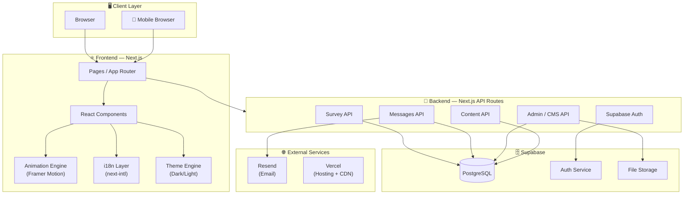
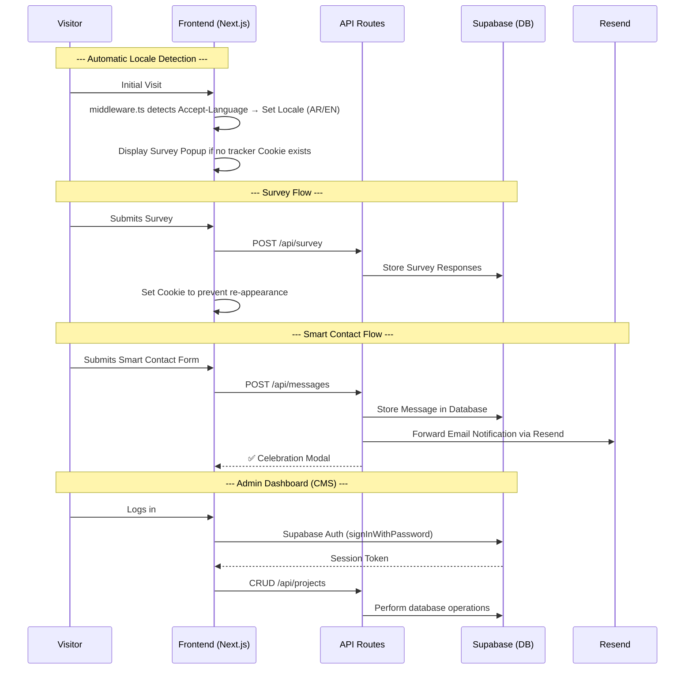
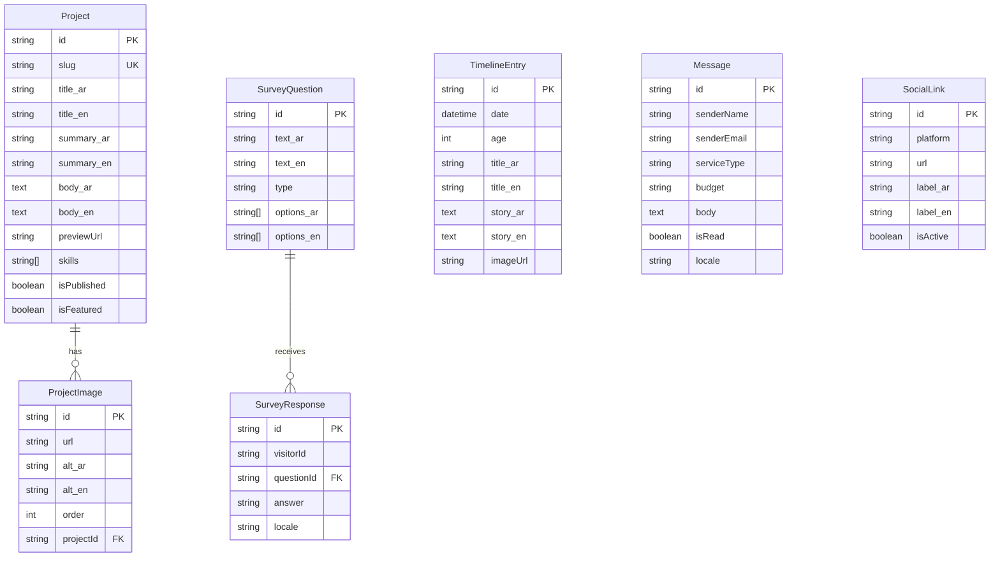

# 🏗️ System Architecture & Data Model
## Advanced Personal Page — v1.3

---

## 1. High-Level Architecture



---

## 2. Data Flow Pattern



---

## 3. Project Structure

```
advanced-personal-page/
├── public/
│   ├── images/
│   │   ├── character/          # Transparent character PNG for 2.5D parallax
│   │   └── static/             # General static assets
│   └── locales/                # Fallback localization files
├── src/
│   ├── app/
│   │   ├── [locale]/           # 🌐 i18n — Dynamic locale routing
│   │   │   ├── layout.tsx
│   │   │   ├── page.tsx        # Home Page (The Hook)
│   │   │   ├── journey/
│   │   │   │   └── page.tsx    # Journey (The Story)
│   │   │   ├── portfolio/
│   │   │   │   ├── page.tsx    # Portfolio listing page
│   │   │   │   └── [slug]/
│   │   │   │       └── page.tsx # Project Details page
│   │   │   └── contact/
│   │   │       └── page.tsx    # Contact Page (Smart Contact Form)
│   │   ├── admin/              # Protected admin dashboard (outside localization routing)
│   │   │   ├── layout.tsx      # Protected layout using Supabase Auth
│   │   │   ├── page.tsx        # Dashboard home page
│   │   │   ├── projects/       # 🆕 CMS — Project management
│   │   │   ├── analytics/
│   │   │   ├── messages/
│   │   │   └── settings/
│   │   └── api/
│   │       ├── auth/
│   │       ├── survey/
│   │       ├── messages/
│   │       ├── projects/       # 🆕 CRUD API for projects
│   │       └── admin/
│   ├── components/
│   │   ├── shared/             # Footer, Navbar, LanguageSwitcher, ThemeSwitcher
│   │   ├── home/               # Hero, CharacterParallax, CardShuffle
│   │   ├── journey/            # Timeline cards
│   │   ├── portfolio/          # Project cards, Gallery
│   │   ├── contact/            # SmartContactForm, SurveyPopup
│   │   └── admin/              # CMS forms, Analytics charts
│   ├── hooks/
│   ├── lib/
│   │   ├── supabase/           # 🆕 Supabase client configuration
│   │   ├── resend/             # 🆕 Resend API initialization
│   │   └── i18n/               # 🆕 i18n setup
│   ├── messages/               # 🆕 Localized dictionary assets (ar.json, en.json)
│   ├── types/
│   └── styles/
│       ├── themes/             # 🆕 dark.css, light.css stylesheets
│       └── globals.css
├── prisma/
│   └── schema.prisma
├── next.config.js
└── .env.local                  # Environment variables (Supabase secrets, Resend key)
```

---

## 4. Confirmed Tech Stack

> [!IMPORTANT]
> All technolgies listed below are **confirmed** for implementation.

### Frontend

| Component | Technology | Status |
|---|---|---|
| **Framework** | Next.js (App Router) | ✅ Confirmed |
| **Motion Engine** | Framer Motion (`useSpring`, `useTransform`) | ✅ Confirmed |
| **2.5D Parallax Library** | Atropos.js or Vanilla Tilt.js | ✅ Confirmed as fallback |
| **Language** | TypeScript | ✅ Confirmed (A-01) |
| **Styling** | CSS Modules or Tailwind CSS | Inferred |
| **Localization (i18n)** | `next-intl` or `next-i18next` | Inferred (Dual Language Support) |
| **Arabic Typography** | **Readex Pro** (Google Fonts) | ✅ Confirmed |
| **Latin Typography** | **Plus Jakarta Sans** (Google Fonts) | ✅ Confirmed |

### Backend & Infrastructure

| Component | Technology | Status |
|---|---|---|
| **Hosting** | **Vercel** | ✅ Confirmed |
| **Database** | **Supabase (PostgreSQL)** | ✅ Confirmed |
| **Identity / Auth** | **Supabase Auth** | ✅ Confirmed |
| **ORM** | Prisma (Client integration with Supabase PostgreSQL) | ✅ Confirmed (A-03) |
| **API** | Next.js API Routes / Server Actions | Integrated |
| **Object Storage** | Supabase Storage (Project media upload) | Inferred |

### External Services

| Service | Technology | Status |
|---|---|---|
| **Email Gateway** | **Resend** | ✅ Confirmed |
| **Behavioral Analytics** | 🆕 **Vercel Analytics** (Non-blocking analytics) | ✅ Confirmed |
| **API Protection** | 🆕 **Upstash Rate Limit** (Redis-backed serverless rate limiter) | ✅ Confirmed |
| **Content Delivery Network** | Vercel Edge Network | Native |
| **Image Optimization** | Next.js `next/image` + Vercel Image Optimization | Native |

---

## 5. Data Model

### 5.1 Prisma Schema

```prisma
// ==============================================
// Advanced Personal Page — Prisma Schema v1.3
// Database: Supabase (PostgreSQL)
// Auth: Supabase Auth (Managed by Supabase Auth service)
// ==============================================

generator client {
  provider = "prisma-client-js"
}

datasource db {
  provider  = "postgresql"
  url       = env("DATABASE_URL")     // Supabase connection string
  directUrl = env("DIRECT_URL")       // Supabase direct connection (for migrations)
}

// ─────────────────────────────────────────────
// Social Media Links
// ─────────────────────────────────────────────
model SocialLink {
  id        String   @id @default(cuid())
  platform  String                              // whatsapp, linkedin, mostaql, etc.
  url       String
  label_ar  String                              // 🆕 Arabic translation text
  label_en  String                              // 🆕 English translation text
  icon      String?                             // Icon key identifier
  order     Int      @default(0)                // Sorting weight
  isActive  Boolean  @default(true)

  createdAt DateTime @default(now())
  updatedAt DateTime @updatedAt
}

// ─────────────────────────────────────────────
// Portfolio Projects (Managed via Admin CMS)
// ─────────────────────────────────────────────
model Project {
  id          String   @id @default(cuid())
  slug        String   @unique                   // URL parameter: /portfolio/{slug}
  title_ar    String                              // 🆕 Arabic title text
  title_en    String                              // 🆕 English title text
  summary_ar  String                              // 🆕 Arabic summary translation
  summary_en  String                              // 🆕 English summary translation
  body_ar     String   @db.Text                   // 🆕 Detailed Arabic description
  body_en     String   @db.Text                   // 🆕 Detailed English description
  previewUrl  String?                             // Live preview link
  skills      String[]                            // Tech stack array tags
  buildTime   String?                             // Duration (e.g. "أسبوعان")
  order       Int      @default(0)                // Display priority weight
  isPublished Boolean  @default(false)
  isFeatured  Boolean  @default(false)             // 🆕 Display on Home landing page

  images      ProjectImage[]

  createdAt   DateTime @default(now())
  updatedAt   DateTime @updatedAt
}

model ProjectImage {
  id        String  @id @default(cuid())
  url       String                                // Resource URL (Supabase Storage)
  alt_ar    String?                               // 🆕 Arabic accessibility text
  alt_en    String?                               // 🆕 English accessibility text
  order     Int     @default(0)
  projectId String
  project   Project @relation(fields: [projectId], references: [id], onDelete: Cascade)
}

// ─────────────────────────────────────────────
//  Timeline Entries (Journey)
// ─────────────────────────────────────────────
model TimelineEntry {
  id          String   @id @default(cuid())
  date        DateTime
  age         Int                                  // Age at the time of achievement
  title_ar    String                               // 🆕 Arabic title text
  title_en    String                               // 🆕 English title text
  story_ar    String   @db.Text                    // 🆕 Detailed Arabic story
  story_en    String   @db.Text                    // 🆕 Detailed English story
  imageUrl    String?
  order       Int      @default(0)

  createdAt   DateTime @default(now())
  updatedAt   DateTime @updatedAt
}

// ─────────────────────────────────────────────
// Survey Questions
// ─────────────────────────────────────────────
model SurveyQuestion {
  id           String   @id @default(cuid())
  text_ar      String                              // 🆕 Arabic question text
  text_en      String                              // 🆕 English question text
  type         String                              // multiple_choice | free_text
  options_ar   String[]                            // 🆕 Arabic options
  options_en   String[]                            // 🆕 English options
  order        Int      @default(0)
  isRequired   Boolean  @default(false)
  isActive     Boolean  @default(true)

  responses    SurveyResponse[]

  createdAt    DateTime @default(now())
  updatedAt    DateTime @updatedAt
}

// ─────────────────────────────────────────────
// Survey Responses
// ─────────────────────────────────────────────
model SurveyResponse {
  id           String   @id @default(cuid())
  visitorId    String                              // Anonymous tracker UUID
  questionId   String
  question     SurveyQuestion @relation(fields: [questionId], references: [id])
  answer       String                              // Value of choice or free text
  locale       String   @default("ar")             // 🆕 Visitor locale at the time of submission

  createdAt    DateTime @default(now())
}

// ─────────────────────────────────────────────
// User Messages (Smart Contact Form)
// ─────────────────────────────────────────────
model Message {
  id          String   @id @default(cuid())
  senderName  String
  senderEmail String
  serviceType String                               // MVP | SaaS | AI Integration
  budget      String                               // Budget range tier
  body        String   @db.Text
  isRead      Boolean  @default(false)
  emailStatus String   @default("pending")         // 🆕 Delivery status: pending | sent | failed
  locale      String   @default("ar")              // 🆕 Locale of the sender

  createdAt   DateTime @default(now())
}
```

### 5.2 ER Diagram (Entity-Relationship)



---

## 6. API Specifications

### 6.1 Authentication

> **Core Engine: Supabase Auth**
> Authentication flow is delegated entirely to the Supabase client wrapper:
> - `signInWithPassword` — Authenticates credentials
> - `signOut` — Terminates server sessions
> - Session storage and tokens are handled natively.

> [!CAUTION]
> **Disable Registration (Sign-up):** The sign-up capability must be disabled within the Supabase Auth Settings panel to prevent unauthorized administrative accounts. A single user profile is initialized directly via the Supabase database dashboard, with backend integrations allowing only sign-in requests.

| Request / Action | Method / Service |
|---|---|
| Administrative Log In | `supabase.auth.signInWithPassword({ email, password })` |
| Administrative Log Out | `supabase.auth.signOut()` |
| Session Validation | `supabase.auth.getSession()` |
| API Route Protection | Middleware checks matching Supabase session headers |
| Account Creation | **Disabled** — Invite-Only / Direct initialization only |

### 6.2 Row Level Security (RLS) Policies

> [!WARNING]
> Restricting route validation solely via Next.js Middleware is insufficient. **Row-Level Security (RLS) policies must be explicitly enabled on all database relations.**

| Entity / Table | SELECT (Read) | INSERT (Write) | UPDATE / DELETE |
|---|---|---|---|
| `Project` | ✅ Public (anon) | 🔒 authenticated only | 🔒 authenticated only |
| `ProjectImage` | ✅ Public (anon) | 🔒 authenticated only | 🔒 authenticated only |
| `TimelineEntry` | ✅ Public (anon) | 🔒 authenticated only | 🔒 authenticated only |
| `SocialLink` | ✅ Public (anon) | 🔒 authenticated only | 🔒 authenticated only |
| `SurveyQuestion` | ✅ Public (anon) | 🔒 authenticated only | 🔒 authenticated only |
| `SurveyResponse` | 🔒 authenticated only | ✅ Public (anon) | ❌ Restricted |
| `Message` | 🔒 authenticated only | ✅ Public (anon) | 🔒 authenticated only |

---

### 6.3 Public Endpoints

#### `GET /api/projects`
**Usage:** Fetches published portfolio items.
**Parameters:** `?featured=true` restricts results to featured entries for home landing cycles.
```json
// Response 200
{
  "projects": [
    {
      "id": "...",
      "slug": "my-saas-project",
      "title_ar": "مشروعي الأول",
      "title_en": "My First Project",
      "summary_ar": "ملخص المشروع...",
      "summary_en": "Project summary...",
      "skills": ["Next.js", "Supabase"],
      "images": [
        { "url": "https://...", "alt_ar": "...", "alt_en": "..." }
      ]
    }
  ]
}
```

#### `GET /api/projects/:slug`
**Usage:** Fetches project details matching a unique URI parameter.
```json
// Response 200
{
  "project": {
    "id": "...",
    "slug": "my-saas-project",
    "title_ar": "...",
    "title_en": "...",
    "body_ar": "القصة الكاملة...",
    "body_en": "Full story...",
    "previewUrl": "https://...",
    "skills": ["..."],
    "buildTime": "أسبوعان",
    "images": [...]
  }
}
```

#### `GET /api/timeline`
**Usage:** Fetches chronological journey checkpoints.
```json
// Response 200
{
  "entries": [
    {
      "id": "...",
      "date": "2020-01-15",
      "age": 18,
      "title_ar": "بداية تعلم البرمجة",
      "title_en": "Started Learning Programming",
      "story_ar": "...",
      "story_en": "...",
      "imageUrl": "https://..."
    }
  ]
}
```

#### `GET /api/social-links`
**Usage:** Fetches active social shortcuts for navigation components.
```json
// Response 200
{
  "links": [
    {
      "platform": "whatsapp",
      "url": "https://...",
      "label_ar": "واتساب",
      "label_en": "WhatsApp",
      "icon": "whatsapp"
    }
  ]
}
```

---

### 6.4 Interaction Endpoints

#### `GET /api/survey/questions`
**Usage:** Fetches questions for the welcome survey.
```json
// Response 200
{
  "questions": [
    {
      "id": "...",
      "text_ar": "كيف عرفت عني؟",
      "text_en": "How did you find me?",
      "type": "multiple_choice",
      "options_ar": ["LinkedIn", "GitHub", "أخرى"],
      "options_en": ["LinkedIn", "GitHub", "Other"],
      "isRequired": false
    }
  ]
}
```

#### `POST /api/survey/responses`
**Usage:** Commits survey answers from welcome prompts.
```json
// Request
{
  "visitorId": "anonymous-uuid",
  "locale": "ar",
  "responses": [
    { "questionId": "...", "answer": "LinkedIn" },
    { "questionId": "...", "answer": "نص حر..." }
  ]
}

// Response 201
{ "success": true }
```

#### `POST /api/messages`
**Usage:** Stores contact information and body payload.
```json
// Request
{
  "senderName": "أحمد",
  "senderEmail": "ahmed@example.com",
  "serviceType": "SaaS",
  "budget": "$500-$1000",
  "body": "أريد بناء منصة SaaS لإدارة المخزون...",
  "locale": "ar"
}

// Response 201
{ "success": true, "message": "تم استلام طلبك بنجاح" }
```

> **Side Effect:** Submitting a message stores the payload to PostgreSQL and triggers an email alert using **Resend**.
> Failures in Resend execution **must not** rollback the database transaction, but should record a fail status in PostgreSQL.

---

### 6.5 Admin Endpoints (Protected)

> All endpoints in this category require a valid **Supabase Auth Session** header validation.

#### Projects Administration (CMS)

| Method | Endpoint | Description |
|---|---|---|
| `GET` | `/api/admin/projects` | Fetch all project records (including drafts) |
| `POST` | `/api/admin/projects` | 🆕 Create a new project record |
| `PUT` | `/api/admin/projects/:id` | Update project parameters |
| `DELETE` | `/api/admin/projects/:id` | Destroy project record |

> [!WARNING]
> **Orphan Cleanup Policy:** On project deletion, all associated files stored inside the Supabase Storage Bucket must be programmatically deleted. Failing to perform this cleanup leaves orphaned media assets.

> [!NOTE]
> **Slug Uniqueness Policy:** When parsing title inputs into slugs, duplicate strings must trigger auto-incremental suffixes (e.g. `my-project-2`, `my-project-3`) or reject with a user-facing validation prompt to prevent Prisma unique constraint violations.

**`POST /api/admin/projects` — Create Project:**
```json
// Request (multipart/form-data for image upload)
{
  "title_ar": "...",
  "title_en": "...",
  "summary_ar": "...",
  "summary_en": "...",
  "body_ar": "...",
  "body_en": "...",
  "previewUrl": "...",
  "skills": ["Next.js", "Supabase"],
  "buildTime": "أسبوعان",
  "isPublished": true,
  "isFeatured": true,          // Displays on Home landing page
  "images": [File, File, ...]  // Uploaded directly to Supabase Storage
}
```

#### Timeline Administration

| Method | Endpoint | Description |
|---|---|---|
| `GET` | `/api/admin/timeline` | Fetch all timeline checkpoints |
| `POST` | `/api/admin/timeline` | Create timeline checkpoint |
| `PUT` | `/api/admin/timeline/:id` | Update timeline parameters |
| `DELETE` | `/api/admin/timeline/:id` | Destroy timeline entry |

#### Social Links Administration

| Method | Endpoint | Description |
|---|---|---|
| `GET` | `/api/admin/social-links` | Fetch active social links |
| `PUT` | `/api/admin/social-links` | Batch update social links parameters |

#### Survey & Analytics Administration

| Method | Endpoint | Description |
|---|---|---|
| `GET` | `/api/admin/analytics/survey` | Fetch survey metrics categorized by options |
| `GET` | `/api/admin/analytics/export` | Dump raw survey response logs as a JSON payload |

#### Contact Inbox Management

| Method | Endpoint | Description |
|---|---|---|
| `GET` | `/api/admin/messages` | Fetch received messages (paginated) |
| `PUT` | `/api/admin/messages/:id/read` | Mark message as read |
| `DELETE` | `/api/admin/messages/:id` | Destroy message record |
| `POST` | `/api/admin/messages/:id/resend` | 🆕 Manually retry Resend delivery on status failures |

---

## 7. Security & Protection Policies

### 7.1 API Rate Limiting

> [!CAUTION]
> Lack of rate limiting on transactional endpoints leaves Resend email credits open to exploitation.

| Policy | Configuration |
|---|---|
| **Core Service** | **Upstash Rate Limit** (Redis-backed serverless limiter) |
| **Contact Form Limit** | **Max 5 messages per IP per hour** |
| **Survey Submit Limit** | **Max 3 submissions per IP per hour** |
| **Protected Routes** | `POST /api/messages` + `POST /api/survey/responses` |
| **Exceeded Action** | HTTP `429 Too Many Requests` |

### 7.2 Email Forwarding Policy

| Policy | Configuration |
|---|---|
| **Gateway provider** | **Resend** |
| **Trigger Mechanism** | Automatic dispatch on valid `POST /api/messages` |
| **Email Content** | Full client parameters: Sender Name, Email, Service Type, Budget, Details |
| **Transaction Boundary** | Failed email dispatches **must not** revert database record storage |

---

## 8. Performance & Optimization

Designed to satisfy **NFR-01** (Minimizing loading durations):

| Strategy | Details |
|---|---|
| **SSG / ISR** | Use Static Site Generation (SSG) with Incremental Static Regeneration (ISR) |
| **Image Optimization** | Leverage Next.js `next/image` + Vercel Image Optimization (WebP compression) |
| **Code Splitting** | Use dynamic imports for complex, non-critical modules (Animation Engine, Welcome Survey Popup) |
| **Font Optimization** | Load typography resources locally using `next/font/google` |
| **Edge CDN** | Vercel Edge Network routing (automated CDN caching) |
| **Bundle Analysis** | Continuous profiling of compilation bundles to prevent package bloating |
| **Supabase Connection** | Utilize pgBouncer connection pooling |

---

## 9. Localization (i18n) Strategy

| Metric | Configuration |
|---|---|
| **Supported Locales** | Arabic (ar) + English (en) |
| **Locale Resolution** | 🆕 Parse `Accept-Language` headers in **`middleware.ts`** (prevents client hydration mismatches) |
| **Manual Switching** | Interactive locale toggling within the Navigation bar |
| **Visual Direction** | Dynamic CSS styling: RTL for Arabic, LTR for English |
| **URI Patterns** | Routing prefixes `/{locale}/page` (e.g. `/ar/portfolio`, `/en/portfolio`) |
| **Localized Dictionaries** | `src/messages/ar.json` + `src/messages/en.json` |
| **CMS Entities** | Database entries require localized field pairs (`title_ar`, `title_en`, etc.) |

> [!WARNING]
> **Hydration Warning:** Do not read `navigator.language` directly in Client Components to resolve default locales. This leads to Hydration Mismatches between server renders and client instances. Always resolve locales on edge routes (middleware.ts).

---

## 10. Theme Strategy

| Parameter | Configuration |
|---|---|
| **Default State** | **Dark Mode (Default)** |
| **Interactive Toggle** | Theme Toggle switch located in the navbar |
| **Persistence** | Cache configuration in `localStorage` or Cookie stores |
| **Technical Stack** | CSS Custom Properties + dynamic `data-theme` attribute |
| **Stylesheets** | Two independent stylesheet collections (Dark + Light configurations) |

---

## 11. Additional Policies

### 11.1 SEO Policy

| Strategy | Details |
|---|---|
| **Metadata** | Dynamic parameter mapping for each route (`title`, `description`, `og:image`) |
| **Sitemap** | Native `sitemap.xml` generated automatically from dynamic page routing |
| **Crawling Policy** | `robots.txt` allowing public indexing of all landing pages |
| **Structured Data** | Schema.org JSON-LD profiles for Projects (`SoftwareApplication`) and Personal bio (`Person`) |
| **Open Graph** | Social graphics configured for all public URLs |
| **Cross-Referencing** | `hreflang` header mapping to link localized translation variations |

### 11.2 Analytics Policy

| Parameter | Details |
|---|---|
| **Behavioral Metrics** | **Vercel Analytics** (Native tracking without database overhead) |
| **Engagement Logs** | PostgreSQL entries stored via welcome survey APIs |
| **Privacy Standards** | IP addresses and personal identifiers are omitted from database metrics |
| **Motivation** | Prevent write bottlenecks on landing queries and satisfy GDPR regulations |
