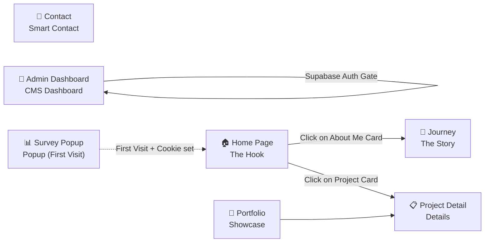

# 🎨 UI/UX Design System & Specifications
## Advanced Personal Page — v1.3

---

## 1. Design Philosophy

> **"Luxury & Serenity"** — This is the core aesthetic principle for the entire project.
> Source: `صفحتي الشخصية (v 1.1).md` — Section 1

Every design decision must pass through this aesthetic filter:
- Does it enhance the feeling of luxury? ✅
- Does it maintain visual serenity? ✅
- Does it add unnecessary visual noise? ❌

---

## 2. Theme System — Dark / Light Mode

> [!IMPORTANT]
> The website is **Dark Mode by default**, with an option to toggle Light Mode manually.

### Dark Theme Color Palette (Dark — Default)

| Role | Color Value | Usage |
|---|---|---|
| **Primary** | Muted Green `≈ hsl(150, 25%, 35%)` | Interactive components, buttons, active links |
| **Background** | Deep Dark `≈ hsl(200, 15%, 8%)` | Page backgrounds |
| **Surface** | Translucent Muted Surface `rgba(255,255,255,0.05) + backdrop-filter: blur()` | Cards, section containers |
| **Text Primary** | Warm White `≈ hsl(40, 10%, 92%)` | Main headings and text |
| **Text Secondary** | Muted Gray `≈ hsl(200, 10%, 60%)` | Subheadings and secondary text |
| **Accent** | Brightened Muted Green | Hover states, highlights |

### Light Theme Color Palette (Light — Optional)

| Role | Color Value | Usage |
|---|---|---|
| **Primary** | Darker Muted Green `≈ hsl(150, 30%, 30%)` | Interactive components, buttons, active links |
| **Background** | Warm White `≈ hsl(40, 20%, 96%)` | Page backgrounds |
| **Surface** | Light Translucent Surface `rgba(0,0,0,0.03) + backdrop-filter: blur()` | Card containers |
| **Text Primary** | Dark Slate Gray `≈ hsl(200, 15%, 15%)` | Main headings and text |
| **Text Secondary** | Medium Slate Gray `≈ hsl(200, 10%, 45%)` | Secondary text |
| **Accent** | Muted Green | Hover states, highlights |

### Technical Implementation

```css
/* CSS Custom Properties */
:root, [data-theme="dark"] {
    --color-primary: hsl(150, 25%, 35%);
    --color-bg: hsl(200, 15%, 8%);
    --color-surface: rgba(255, 255, 255, 0.05);
    --color-text: hsl(40, 10%, 92%);
    --color-text-secondary: hsl(200, 10%, 60%);
}

[data-theme="light"] {
    --color-primary: hsl(150, 30%, 30%);
    --color-bg: hsl(40, 20%, 96%);
    --color-surface: rgba(0, 0, 0, 0.03);
    --color-text: hsl(200, 15%, 15%);
    --color-text-secondary: hsl(200, 10%, 45%);
}
```

### Color Usage Rules

1. **Backdrop Blur:** Obligatory for all card surfaces and popup containers in both themes.
2. **Background Blending:** Elements must blend smoothly with the background — avoid sharp borders or stark contrasts.
3. **Contrast Ratio:** Must satisfy **WCAG AA** standards as a minimum threshold in both themes.
4. **State Storage:** Save user theme preferences inside `localStorage`.

---

## 3. Responsive Design

> [!IMPORTANT]
> The specification requires an **independent responsive layout design** for Desktop and Mobile devices rather than simple CSS fluid adaptation.

### Platform Layout Strategies

| Device Platform | Design Pattern | Notes |
|---|---|---|
| **Desktop (≥ 1024px)** | Full Interactive Experience | Hover states, interactive mouse movement, 2.5D Parallax |
| **Mobile (< 768px)** | Independent Mobile Layout | Touch interactions, simplified animations, performance optimized |
| **Tablet (768px – 1023px)** | Hybrid Adaptation | Smart layout stretching and scaling between platforms |

### Platform Layout Rules

**Desktop Layout Rules:**
- "About Me" card + 2.5D character PNG with full interactive Parallax.
- Portfolio showcase: Horizontal grid (Summary on the right, images on the left).
- Chronological timeline: Alternating timeline cards with right-side details.

**Mobile Layout Rules:**
- Simplify 2.5D parallax to Touch Tilt or fallback to static image for performance.
- Portfolio showcase: Vertical stack (Card listing).
- Chronological timeline: Single-column vertical list.
- Welcome Survey: Full-screen single card display per question.

---

## 4. Layout System

### Grid System

```
Desktop:  12-column grid, max-width: 1280px, gap: 24px
Tablet:   8-column grid, padding: 24px
Mobile:   4-column grid, padding: 16px
```

### Spacing Scale

```
--space-xs:   4px
--space-sm:   8px
--space-md:   16px
--space-lg:   24px
--space-xl:   32px
--space-2xl:  48px
--space-3xl:  64px
--space-4xl:  96px
```

---

## 5. Typography

> [!IMPORTANT]
> Font configuration is confirmed as follows:
> - **Arabic Locale:** Readex Pro
> - **Latin Locale:** Plus Jakarta Sans

| Level | Arabic Font | English Font | Desktop Size | Mobile Size |
|---|---|---|---|---|
| **Display / Hero** | Readex Pro | Plus Jakarta Sans | 48–64px | 28–36px |
| **Heading 1** | Readex Pro | Plus Jakarta Sans | 36–40px | 24–28px |
| **Heading 2** | Readex Pro | Plus Jakarta Sans | 28–32px | 20–24px |
| **Body** | Readex Pro | Plus Jakarta Sans | 16–18px | 14–16px |
| **Caption / Small** | Readex Pro | Plus Jakarta Sans | 12–14px | 12px |

### Typography Rules

- **Directionality:** RTL for Arabic, LTR for English — toggles dynamically with page locale.
- **Line Height:** `1.6` for body text, `1.2` for headings.
- **Font Weight:** Regular (400) for body, Bold (700) for titles and headings.
- **Loading Optimization:** Use `next/font/google` for local font assets caching.

### Technical Snippet

```tsx
// next/font/google integration
import { Readex_Pro, Plus_Jakarta_Sans } from 'next/font/google';

const readexPro = Readex_Pro({
  subsets: ['arabic', 'latin'],
  variable: '--font-ar',
  display: 'swap',               // Prevents Flash of Invisible Text (FOIT)
});

const plusJakartaSans = Plus_Jakarta_Sans({
  subsets: ['latin'],
  variable: '--font-en',
  display: 'swap',               // Prevents Flash of Invisible Text (FOIT)
});
```

---

## 6. Component Tokens

### 6.1 Cards

```css
.card {
    background: var(--color-surface);
    backdrop-filter: blur(16px);
    border: 1px solid rgba(255, 255, 255, 0.08);
    border-radius: 16px;
    padding: var(--space-lg);
    transition: transform 0.3s ease, box-shadow 0.3s ease;
}

.card:hover {
    transform: translateY(-4px);
    box-shadow: 0 16px 48px rgba(0, 0, 0, 0.3);
}
```

### 6.2 Smart Contact Card — Glassmorphism Card

```css
.smart-contact-card {
    background: rgba(255, 255, 255, 0.06);
    backdrop-filter: blur(24px);
    -webkit-backdrop-filter: blur(24px);
    border: 1px solid rgba(255, 255, 255, 0.1);
    border-radius: 20px;
    padding: var(--space-2xl);
    box-shadow: 0 8px 32px rgba(0, 0, 0, 0.25);
}
```

### 6.3 Buttons

```css
.btn-primary {
    background: var(--color-primary);
    color: var(--color-text);
    border: none;
    border-radius: 12px;
    padding: 12px 24px;
    font-weight: 600;
    transition: all 0.2s ease;
}

.btn-primary:hover {
    filter: brightness(1.15);
    transform: translateY(-2px);
}

/* Submit Project Button: "ابدأ المشروع 🚀" */
.btn-submit-project {
    background: linear-gradient(135deg, var(--color-primary), var(--color-accent));
    font-size: 1.1rem;
    padding: 14px 32px;
    border-radius: 14px;
}
```

---

## 7. Animation Density Map

| Page / Section | Density Level | Examples |
|---|---|---|
| Footer / Navbar | 🟢 **Low** | Fade-in transitions, simple hover animations |
| Home Page (Hero) | 🔴 **High** | 2.5D Parallax character, Card Shuffle, floating title texts |
| Journey (Timeline) | 🔴 **High** | Scroll-triggered entry animations, chronological path transitions |
| Portfolio Showcase | 🔴 **High** | Fluid image scaling, fullscreen gallery transitions |
| Contact & Survey | 🔴 **High** | Survey card card flips, feedback celebrations, glassmorphism fades |
| Admin Dashboard | 🟢 **Low** | Functionality first, simple layout transitions |

---

## 8. Page Map



---

## 9. Page-by-Page Specifications

### 9.1 Shared Welcome Prompt: Survey Popup

> [!IMPORTANT]
> The survey is **not an independent page**, but a **welcome overlay modal** that triggers automatically during first-time visits only.

| UI Element | Specification details |
|---|---|
| **Trigger Mechanism** | Automatically overlays on first page load |
| **Persistence** | Uses **Cookies** — will not load again once dismissed or completed |
| **Interface** | Card-based interactive UI (not a traditional flat form) |
| **Questions** | Asks visitors about how they discovered the page and their project goals |
| **Fields** | Multiple Choice Options + Free text fields |
| **Dismissal** | Visitors can skip individual questions or close the survey popup entirely |
| **UX Guideline** | Non-intrusive flow — smooth exit animations |

---

### 9.2 PAGE-01: Home Page — The Hook

#### Goal
Instantly capture visitor attention with a luxurious aesthetic and convey the developer's identity.

#### Sections

##### Section 1: Hero — "About Me"

| Element | Specification details |
|---|---|
| **Floating Bio** | Introductory title text with a slow floating motion (Y-axis oscillaion) |
| **2.5D Character** | Transparent PNG character formatted with perspective tilt layers |
| **Interaction** | Character follows cursor movement with spring inertia |
| **Navigation** | Clicking this section redirects to the "Journey" page |
| **Layout Direction** | RTL (Arabic layout: text on right, character on left) / LTR (English layout: text on left, character on right) |

**Simplified Wireframe (Desktop):**
```
┌─────────────────────────────────────────────┐
│   Navbar  [🌐 AR/EN] [🌙/☀️]               │
├──────────────────────┬──────────────────────┤
│                      │                      │
│   [نبذة تعريفية]          │   [شخصية 2.5D]        │
│   تطفو بأناقة             │   PNG شفاف            │
│                      │ تتبع الماوس بتأخير          │
│                      │                      │
├──────────────────────┴──────────────────────┤
│              ↓ الضغط = رحلتي                   │
└─────────────────────────────────────────────┘
```

**Simplified Wireframe (Mobile):**
```
┌──────────────────────┐
│ Navbar [🌐] [🌙/☀️] │
├──────────────────────┤
│    [شخصية 2.5D]      │
│    (Touch Tilt)      │
├──────────────────────┤
│  [نبذة تعريفية]     │
│  تطفو بأناقة        │
├──────────────────────┤
│   ↓ الضغط = رحلتي   │
└──────────────────────┘
```

##### Section 2: Projects Preview — Card Shuffle

| Element | Specification details |
|---|---|
| **Display Layout** | **Card Shuffle (stacked project cards)** powered by Framer Motion |
| **Behavior** | Stacked cards cycle through the listing using layout animations |
| **Auto-play** | Cards transition automatically every **5 seconds** |
| **Card Content** | Floating project image + backdrop blur + project summary |
| **Interaction** | Clicking a card opens the detailed Project page |
| **Navigation Controls** | Manual Previous/Next buttons + indicators (active dots) |
| **Data Source** | Supabase database API (CMS configurations) |

**Wireframe (Desktop):**
```
┌─────────────────────────────────────────────┐
│              عنوان "مشاريعي"                    │
├─────────────────────────────────────────────┤
│                                             │
│          ┌──────────────┐                   │
│        ┌──────────────┐ │                   │
│      ┌──────────────┐ │ │                   │
│      │   📷 صورة    │ │─┘                   │
│      │   (تطفو)      │─┘     Card Shuffle    │
│      │   نبذة         │       ← Framer Motion │
│      └──────────────┘                       │
│              ● ● ○ ○ ○                      │
│                                             │
└─────────────────────────────────────────────┘
```

---

### 9.3 PAGE-02: Journey — The Story

#### Goal
Present the developer's journey, milestones, and personal growth using chronological stories.

#### Access Point
Triggered by clicking the "About Me" card from the Home page.

#### Design Pattern
**Vertical timeline featuring scroll-triggered progress cards.**

#### Card Structure

| Field | Layout position | Description |
|---|---|---|
| **Date** | Top of card | Milestone date or year |
| **Age** | Next to date | Age of the developer at that timeline point |
| **Image** | Left of card | Image representing the milestone/technology |
| **Narrative** | Right of card | Storytelling element: motivations, circumstances, and personal impact |

> [!IMPORTANT]
> **Content Policy:** Focus on the human story and personal achievements rather than dry technical specifications.

**Wireframe (Desktop):**
```
┌─────────────────────────────────────────────┐
│                رحلتي                          │
├─────────────────────────────────────────────┤
│                    │                        │
│  2020 — عمري 18   ─●─  ┌──────────────────┐  │
│                    │  │ 📷    │  ملخص    │   │
│                    │  │ صورة  │  قصصي    │   │
│                    │  │       │  إنساني    │   │
│                    │  └──────────────────┘  │
│                    │                        │
│  2021 — عمري 19   ─●─  ┌──────────────────┐  │
│                    │  │ 📷    │   ملخص   │  │
│                    │  │ صورة  │  قصصي    │  │
│                    │  └──────────────────┘  │
│                    │                        │
│                   ...                       │
└─────────────────────────────────────────────┘
```

---

### 9.4 PAGE-03: Portfolio

#### Goal
Showcase project items with a high-end visual layout.

#### Data Source
**Supabase** — Managed via the Admin CMS Dashboard.

#### List View

| Element | Location | Description |
|---|---|---|
| **Project Summary** | Right side | Localized project summary text |
| **Project Images** | Left side | Auto-cycling or static project screenshot previews |
| **Interaction** | Entire Card | Clicking redirect to details page |

**Wireframe (Desktop):**
```
┌─────────────────────────────────────────────┐
│              معرض المشاريع                 │
├─────────────────────────────────────────────┤
│  ┌────────────────────┬────────────────────┐│
│  │   ملخص المشروع 1   │          📷 صور  │ │
│  │   وصف مختصر         │  (ثابتة/متغيرة) │ │
│  └────────────────────┴────────────────────┘ │
│  ┌────────────────────┬────────────────────┐ │
│  │   ملخص المشروع 2   │          📷 صور  │ │
│  │ وصف مختصر       │    (ثابتة/متغيرة)   │ │
│  └────────────────────┴────────────────────┘ │
└─────────────────────────────────────────────┘
```

#### Project Detail (Detailed View)

| Parameter | Specification details |
|---|---|
| **Preview Link** | Live website link |
| **Image Gallery** | Auto-playing gallery with fallback manual slide navigation every 5 seconds |
| **Zoom View** | Fullscreen lightboxes with strict image quality boundaries |
| **Development Story** | Narrative explaining the construction and roadmap |
| **Challenges & Solutions** | Technical hurdles faced and resolved |
| **Build Duration** | Duration of development |
| **Skills & Tech Stack** | Database array tags rendered as badge components |
| **Motivation** | Motivation behind building the project |

---

### 9.5 PAGE-04: Contact — Smart Contact Form

#### Goal
Allow visitors and prospective clients to request project services via an interactive questionnaire.

#### Smart Contact Form

> [!IMPORTANT]
> **Not a generic contact sheet** — but a glassmorphic questionnaire configured to collect essential budget and project details.

| Element | Specification details |
|---|---|
| **Design** | Translucent glassmorphism container (`backdrop-filter: blur(24px)`) |
| **Field 1** | Client Name and Email address |
| **Field 2** | Service Type drop-down selection: `MVP`, `SaaS`, `AI Integration` |
| **Field 3** | Budget scale selection: `$150-$500`, `$500-$1000`, `+$1000` |
| **Field 4** | Message body details |
| **Action CTA** | **"ابدأ المشروع 🚀"** (Start Project) |
| **Success Alert** | Modal window: `"تم استلام طلبك! سأقوم بدراسته والرد عليك خلال 24 ساعة بخطة عمل."` (Success notification message in Arabic/English translation equivalents) |
| **Background Processing** | Commits to Supabase database and triggers notification via Resend |

**Wireframe (Desktop):**
```
┌─────────────────────────────────────────────┐
│                                             │
│         ╔══════════════════════════╗        │
│         ║   📬 Smart Contact Form  ║        │
│         ║   ┌──────────────────┐   ║        │
│         ║   │    الاسم   │   البريد │   ║        │
│         ║   └──────────────────┘   ║        │
│         ║   ┌──────────────────┐   ║        │
│         ║   │ نوع الخدمة ▼        │   ║        │
│         ║   └──────────────────┘   ║        │
│         ║   ┌──────────────────┐   ║        │
│         ║   │ الميزانية             │   ║        │
│         ║   │ ○ $150-500       │   ║        │
│         ║   │ ○ $500-1000      │   ║        │
│         ║   │ ○ +$1000         │   ║        │
│         ║   └──────────────────┘   ║        │
│         ║   ┌──────────────────┐   ║        │
│         ║   │ تفاصيل الرسالة        │   ║        │
│         ║   │                  │   ║        │
│         ║   └──────────────────┘   ║        │
│         ║                          ║        │
│         ║   [  ابدأ المشروع 🚀  ]      ║        │
│         ╚══════════════════════════╝        │
│           ↑ Glassmorphism Card              │
└─────────────────────────────────────────────┘
```

#### Feedback Section

| Parameter | Details |
|---|---|
| **Objective** | Accept recommendations, suggestions, or technical bugs from general visitors |
| **Design** | Clean layout separate from client project flows |

---

### 9.6 PAGE-05: Admin Dashboard — CMS

#### Goal
Allow the developer to modify portfolio details, examine survey insights, and read visitor requests.

#### Gatekeeper
Protected layout requiring authenticated Supabase session logins (disabled public signups).

#### Panels

| Panel | Functionality |
|---|---|
| **Project CMS** | Full CRUD capabilities (Add, Edit, Delete) for localized project fields |
| **Link CMS** | Manage active social media links (URL, order, platform type) |
| **Surveys Insight** | Categorized charts of survey responses + visitor metrics |
| **Data Exporter** | JSON export capability for survey responses and account statistics |
| **Inbox Reader** | Paginated view of messages received from the Smart Contact Form |
| **Mail Monitor** | 🆕 Real-time Resend dispatch indicators: "Sent" / "Failed" + manual "Retry Forwarding" CTA |
| **Forwarding Engine** | Automated email relay module powered by Resend |

**Wireframe (Desktop):**
```
┌──────────┬──────────────────────────────────┐
│          │        لوحة التحكم              │
│  القائم ├──────────────────────────────────┤
│          │  ┌─────────┐  ┌─────────┐        │
│ • المشاريع│ │ إحصائية │ │   إحصائية │      │
│ • الروابط │  │   #1    │  │     #2    │       │
│ • التحليل   │  └─────────┘  └─────────┘       │
│ • الرسائل   │                                  │
│ • التصدير   │  ┌──────────────────────────┐   │
│ • الإعداد │  │   تحليلات الاستبيان       │   │
│          │  │   + تحليلات سلوكية        │   │
│          │  └──────────────────────────┘   │
│          │                                  │
│          │  ┌──────────────────────────┐   │
│          │  │   آخر الرسائل           │   │
│          │  └──────────────────────────┘   │
└──────────┴──────────────────────────────────┘
```

---

## 10. Shared Components

### 10.1 Navigation Bar (Navbar)

| Element | Description |
|---|---|
| **Links** | Home, Portfolio, Contact, Journey |
| **Language Switcher** | 🌐 Dynamic switch between AR ↔ EN |
| **Theme Switcher** | 🌙/☀️ Toggle Dark ↔ Light modes |

### 10.2 Footer

#### Layout & Connections
- Stays persistently at the bottom of the viewport, with a minimal design that doesn't compete with page content.
- Contains direct social shortcuts: WhatsApp, LinkedIn, Mostaql.
- Leverages a dynamic database array to allow future platform additions without altering base footer code.
- Includes language and theme toggle options.

#### Styling Token
```css
/* Footer CSS Token */
.footer-container {
    padding: var(--space-xl) var(--space-lg);
    background: var(--color-surface);
    backdrop-filter: blur(16px);
    border-top: 1px solid rgba(255, 255, 255, 0.08);
}
```
