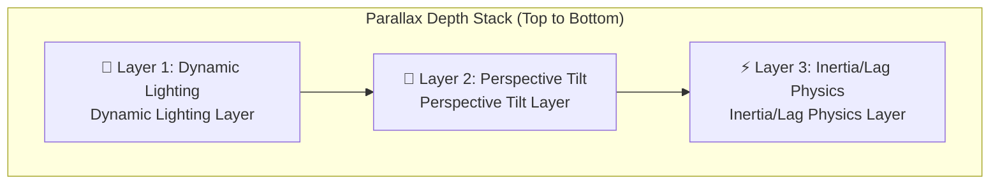

# 🎬 Animation & Motion Design Specifications
## Advanced Personal Page — v1.3

---

## 1. Motion Philosophy

> **Golden Rule:** Muted animations on general layout wrappers, with **cinematic, high-density motion** on main landing sections.

### Motion Classifications

| Tier | Target Sections | Description |
|---|---|---|
| **Tier 1 — Subtle** | Footer, Navbar, Admin Dashboard | Simple fade-ins, basic hover feedback, and smooth transitions |
| **Tier 2 — Rich** | — | Reserved for future interactive dashboard expansions |
| **Tier 3 — Cinematic** | Home Hero, Journey Timeline, Portfolio Detail, Contact Popup | Advanced spring physics, interactive parallax, and scroll-triggered animations |

---

## 2. 2.5D Parallax — Technical Specifications

> **Primary Source:** `2.5D Parallax.md`
> **Location:** Hero Section (About Me Card) on Home landing

> [!IMPORTANT]
> The target asset is **not a true 3D model** — it is a **flat, transparent PNG character** optimized with visual transformations to deliver a 3D depth illusion.

### 2.1 The Three-Layer System



---

#### Layer 1: Dynamic Lighting

| Metric | Specification |
|---|---|
| **Technology** | Overlay `div` positioned on top of the image containing a transparent radial gradient |
| **Behavior** | When the cursor shifts left ← the gradient spotlight translates right (inverse offset) |
| **Objective** | Tricks the brain into perceiving depth by reflecting light off a simulated convex surface |

**Reference Implementation:**
```tsx
// Pseudo-code — Framer Motion
const lightX = useTransform(mouseX, [0, width], [100, 0]); // Inverse direction mapping

<motion.div
  className="light-overlay"
  style={{
    background: `radial-gradient(circle at ${lightX}% 50%, 
      rgba(255,255,255,0.15), transparent 60%)`,
    position: 'absolute',
    inset: 0,
    pointerEvents: 'none',
  }}
/>
```

---

#### Layer 2: Perspective Tilt

| Metric | Specification |
|---|---|
| **Technology** | CSS `transform: perspective() rotateX() rotateY()` |
| **Max Rotation** | **Strictly ±15 degrees** (prevents exposing the flat nature of the PNG) |
| **Cursor Mapping** | Angular values bound to real-time mouse positions |
| **Perspective Depth** | `1000px` |

**Reference Implementation:**
```tsx
// Pseudo-code — Framer Motion
const rotateX = useTransform(mouseY, [0, height], [15, -15]);
const rotateY = useTransform(mouseX, [0, width], [-15, 15]);

<motion.div
  style={{
    perspective: 1000,
    rotateX,
    rotateY,
    transformStyle: 'preserve-3d',
  }}
>
  {/* Flat transparent PNG character asset */}
  <Image src="/images/character/character.png" alt="Personal Character" />
</motion.div>
```

---

#### Layer 3: Inertia / Lag Physics

| Parameter | Specification |
|---|---|
| **Technical Stack** | Linear Interpolation (Lerp) or spring-based physics libraries |
| **Core Equation** | `currentX = lerp(currentX, targetX, 0.1)` |
| **Behavior** | The character lags behind cursor movement with custom mass to create a sense of weight |
| **Constraints** | Restrict translation boundaries — character must not clip card edges or base floors |
| **Preferred Library** | Framer Motion: `useSpring` + `useTransform` |

**Reference Implementation:**
```tsx
// Framer Motion — Spring Physics
const springConfig = { stiffness: 150, damping: 20, mass: 1 };

const characterX = useSpring(
  useTransform(mouseX, [0, width], [-20, 20]),
  springConfig
);

const characterY = useSpring(
  useTransform(mouseY, [0, height], [-10, 10]),
  springConfig
);

// Card moves at a slightly faster rate (stiffer spring configuration)
const cardSpring = { stiffness: 300, damping: 25 };
const cardX = useSpring(useTransform(mouseX, ...), cardSpring);

// The difference in spring stiffness coefficients creates the required lag effect
```

### 2.2 Motion Constraints

| Constraint | Description |
|---|---|
| **Card boundaries** | Character coordinates must remain strictly within the parent card container |
| **Base floor alignment** | The character asset must sit flush on an imaginary ground floor |
| **Max rotation threshold** | Absolute cap of ±15° rotation to preserve image structure |
| **Serenity check** | Parallax physics must remain subtle and professional |

### 2.3 Approved Animation Libraries

| Library | Priority | Usage |
|---|---|---|
| **Framer Motion** | 🥇 Preferred Choice | `useSpring`, `useTransform` — handles the entire interactive physics layer |
| **Atropos.js** | 🥈 Alternative Fallback | Apple TV-like 3D card tilt effects for general static graphics |
| **Vanilla Tilt.js** | 🥉 Basic Fallback | Handles basic hover card tilt and light glare effects |

---

## 3. Card Shuffle (Home Landing)

> [!IMPORTANT]
> The Home landing showcases projects using a stacked **Card Shuffle layout** built using **Framer Motion**.

### Technical Parameters

| Metric | Specification |
|---|---|
| **Visual Effect** | Stacked cards cycle sequentially; front cards slide out and re-stack at the bottom |
| **Transition Cycle** | Auto-play cycles every **5 seconds** |
| **API Library** | **Framer Motion** — `AnimatePresence` + `layout` transitions |
| **Child elements** | Images inside active cards float gently on their own loop |
| **Image Styling** | Custom backdrop blur overlay on nested images |
| **Interactions** | Hovering pauses the auto-play loop |
| **Navigation Controls** | Mobile swipe gestures + manual previous/next CTAs on desktop |

### ⚠️ Execution Warnings (CTO Review)

> [!WARNING]
> **Active `zIndex` clipping during transitions:** When using `AnimatePresence` to cycle stacked layers:
> 1. **`zIndex` values must be updated continuously during transition phases** — not just on layout completion. Failure to do so causes severe clipping.
> 2. **Explicit `layoutId`:** Ensure every card possesses a stable, unique string key.
> 3. **Exit transitions:** Outgoing cards must scale down (`scale: 0.9`) and fade out (`opacity: 0`) to simulate transitioning behind the stack, preventing sudden disappearances.

**Reference Implementation (Optimized):**
```tsx
// Framer Motion — Card Shuffle (CTO Approved)
<AnimatePresence mode="popLayout">
  {cards.map((card, i) => (
    <motion.div
      key={card.id}
      layoutId={`project-card-${card.id}`}  // Unique layoutId
      layout
      initial={{ scale: 0.95, y: 20, opacity: 0 }}
      animate={{
        scale: 1 - i * 0.05,    // Sequential scale reductions
        y: i * -10,               // Vertical stacking offsets
        zIndex: cards.length - i, // Strict zIndex sorting to prevent clipping
        opacity: 1,
      }}
      exit={{
        scale: 0.9,               // Scales down to mimic sliding backward
        opacity: 0,               // Smooth opacity fade
        zIndex: 0,                // Forces exit layers behind the active stack
      }}
      transition={{ type: "spring", stiffness: 300, damping: 30 }}
      style={{ position: 'absolute' }}  // Prevents layout shifting during transitions
    >
      <ProjectCard {...card} />
    </motion.div>
  ))}
</AnimatePresence>
```

---

## 4. Welcome Survey Transitions (Survey Popup)

| Metric | Specification |
|---|---|
| **Design Pattern** | Card-based modal questionnaire inside a fullscreen overlay |
| **Entry Transition** | Soft fade-in + layout scale-up |
| **Card Transitions** | Horizontal card transitions when shifting between questions |
| **Dismissal** | Swipe-to-dismiss layout animations |
| **Exit Transition** | Soft fade-out + scale-down layout animations |

---

## 5. Gallery Transitions (Portfolio Detail)

### Detail View Image Gallery

| Metric | Specification |
|---|---|
| **Manual Navigation** | Horizontal slide transitions with drag thresholds |
| **Auto-play Cycle** | Transitions every **5 seconds** |
| **Zoom View (Fullscreen)** | Soft overlay scale-up with background dimming |
| **Lightbox Dismissal** | Pinch-to-close or click-outside animations |
| **Aspect Ratio Integrity** | Image transitions must not alter the native resolution or distort layers |

---

## 6. Timeline Transitions (Journey Timeline)

| Metric | Specification |
|---|---|
| **Trigger Mechanism** | Scroll-triggered entry animations (fade and slide on viewport entrance) |
| **Entry Transition** | Fade-in + horizontal side offsets |
| **Stagger Effect** | Staggered delays based on entry indices |
| **Desktop Layout** | Alternating alignments (Left-side entry vs Right-side entry) |
| **Mobile Layout** | Single vertical alignment with upward sliding entry animations |

---

## 7. Global Animations

### Home Hero Bio Text

| Parameter | Specification |
|---|---|
| **Behavior** | Bio text oscillates slowly on the vertical axis |
| **Implementation** | CSS keyframe translation bound to Y-axis |
| **Duration** | Slow, non-distracting cycles (≈ 3-4s per oscillation loop) |

### Celebration Modal (Success Notification)

| Parameter | Specification |
|---|---|
| **Trigger** | Successful submit on Smart Contact API |
| **Entry Transition** | Scale-up with spring bounce |
| **FX** | Soft confetti particles container |

### Hover Interactions

| Element | Interactive Feedback |
|---|---|
| **Card wrappers** | Vertical transition `translateY(-4px)` + drop-shadow scaling |
| **CTA Buttons** | Vertical transition `translateY(-2px)` + subtle brightness changes |
| **Hyperlinks** | Color changes + animated line underlines |

### Page Transitions

| Parameter | Specification |
|---|---|
| **Transition Type** | Fade transitions |
| **Duration** | 300–500ms |
| **Easing** | `ease-in-out` |

---

## 8. Performance Considerations

| Rule | Technical Details |
|---|---|
| **GPU Acceleration** | Utilize properties that don't trigger browser layout reflow (e.g. `transform`, `opacity`) |
| **Reduced Motion** | Check media query `prefers-reduced-motion` to disable high-density animations |
| **Mobile Optimization** | Fallback to static images on mobile screen formats to conserve battery life |
| **Lazy Loading** | Dynamically import Framer Motion assets to optimize first-contentful-paint (FCP) scores |
| **Frame Rates** | Target 60fps across all device resolutions |

### 🆕 Mobile 2.5D Fallback (Conditional Loading)

> [!WARNING]
> **Do not bind mousemove/touch listeners on mobile configurations.** It impacts mobile performance scores and consumes unnecessary battery power.

**Solution:** Detect device viewport width using `useMediaQuery` hooks to toggle components conditionally:

```tsx
// Conditional Component Routing
const isMobile = useMediaQuery('(max-width: 768px)');

return isMobile ? (
  // 📱 Mobile: Static fallback image without event listeners
  <StaticCharacterImage />
) : (
  // 🖥️ Desktop: Fully interactive 2.5D parallax character
  <InteractiveCharacterParallax />
);
```

| Viewport | Component loaded | Interactive behavior |
|---|---|---|
| **Mobile (< 768px)** | `StaticCharacterImage` | Static image fallback — no event listeners or spring operations |
| **Desktop (≥ 1024px)** | `InteractiveCharacterParallax` | Complete depth simulation: lighting + perspective + spring lag |
